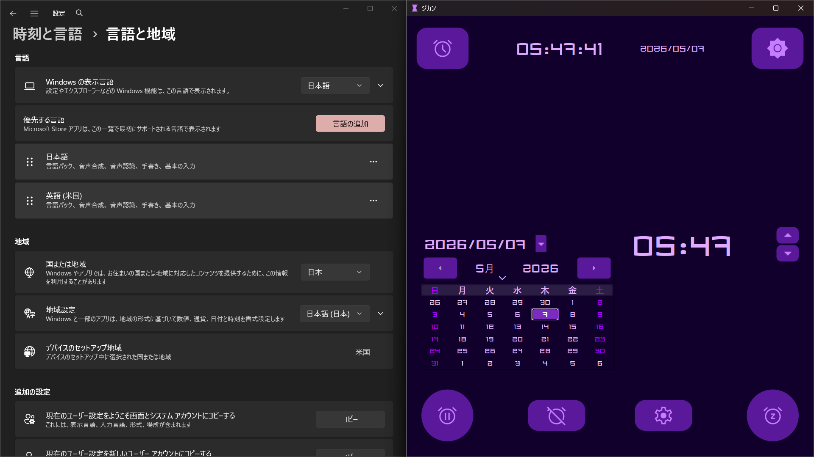
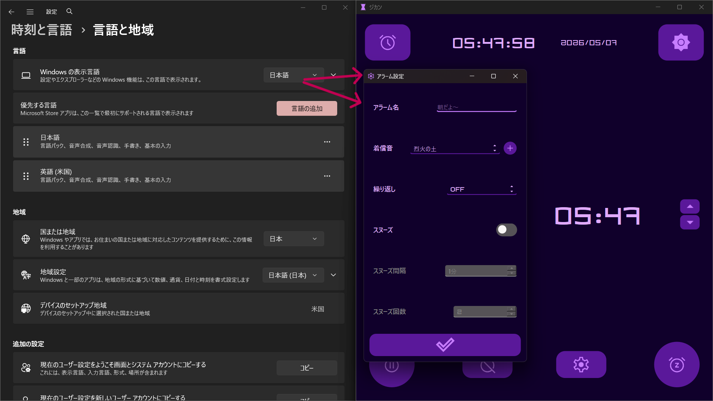
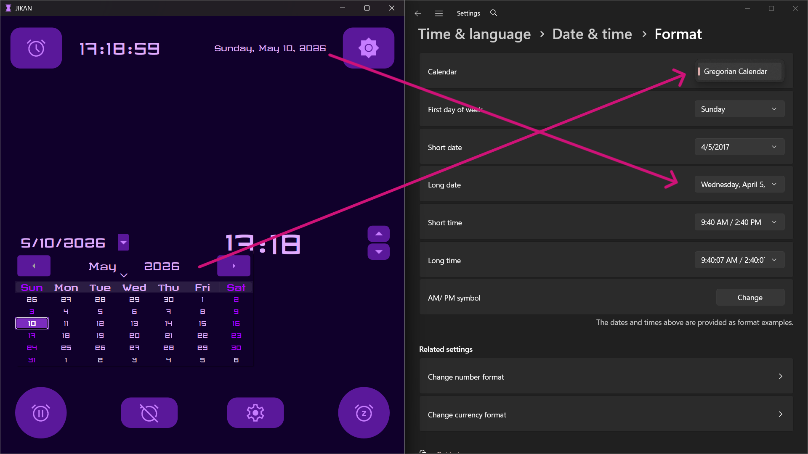
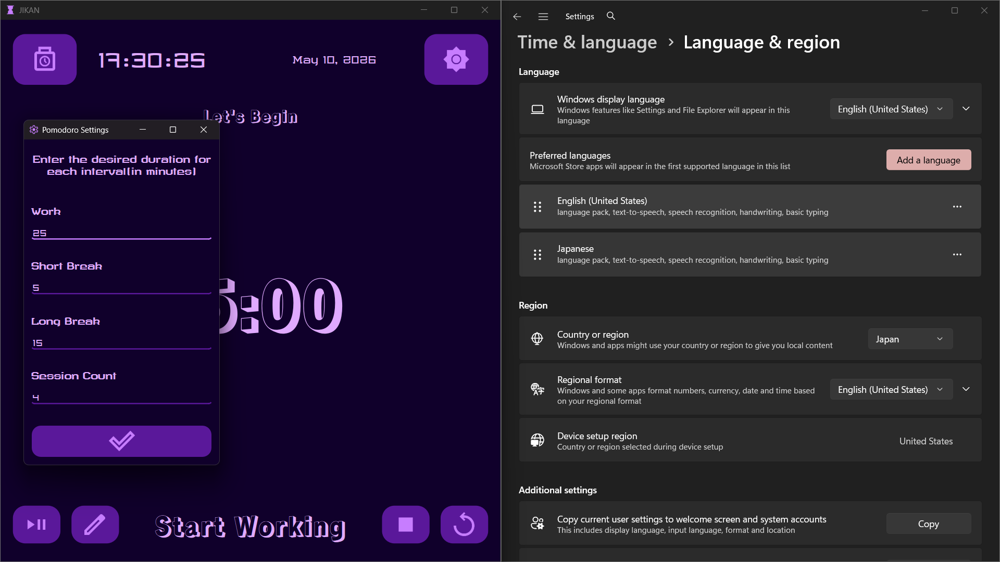

# ジカン・JIKAN

## プレビュー

## 技術構成

   
  - Qt Linguist*
  - Typescript *
      - *翻訳のみ

- GUI:
  - PySide6 (Qt for Python)

- 時刻・日付処理:
  - QDatetime
  - QTimeZone

- タイマー管理:
  - QTimer 

- 多言語対応 【日本語　•　英語】:
  - Qt Linguist
  - QLocale
    - システム言語を自動検出
    - 日本語 / 英語を切り替え

- スタイリング:
  - Qt Style Sheets (QSS)
  - ライト / ダークテーマ対応

- 音声機能:
  - アラーム・通知音再生
  - カスタム音声ファイル読み込み
  - 音源提供元
    - [Miyanova](https://miyanova.com)
    - [EpidemicSound](https://www.epidemicsound.com)

## 手順
**前提条件**
- Python 3.10以上

***

**リポジトリのクローン*
- `git clone https://github.com/yourusername/jikan.git`
- `cd Jikan`

**環境設定**

Windows
  - `python -m venv .venv`
  - `\.venv\Scripts\activate`

MacOS/Linux
  - `python3 -m venv .venv`
  - `source .venv/bin/activate`

**依存関係のインストール**
- `pip install -r requirements.txt `

**アプリケーションの起動**
- `py app.py`
  

## 特徴

- 時計 / タイマー / ストップウォッチ / ポモドーロ / アラームを統合
- システム言語に応じて自動ローカライズ
- 日本語・英語対応
- ライト / ダークモード対応
- タイムゾーン考慮時計・アラーム
- カスタム音声ファイル対応

***

## 概要

このプロジェクトは、日々の作業や学習の集中力を高めるために設計された時間管理ツールです。**時計、タイマー、ストップウォッチ、ポモドーロ、アラーム**の五つの機能を統合し、用途に応じてシームレスに使い分けることで、効率的な時間活用をサポートします。その上、ユーザーのシステム言語設定によって表示される言語と時間や日付形式が決まります。現在のバージョンでは、日本語と英語のみに対応しています。ライトとダークモードも切り替えることもできます。

***

__システム設定によって言語や時間日付形式が決まる__

#### 日本語版

***

#### 英語版

***

***

## 使い方

このアプリでは五つの機能があります。各機能は独立して動作するため、自由に併用できます。使い方は下記で説明されています。

### 時計/日付

ユーザーのシステムのタイムゾーン設定に基づいて、現在の日付と時刻を表示します。
しかし、日付は時間帯よりカレンダーフォーマットによって決まるため、言語設定に関係なく、さまざまな形式で表示される場合があります。
以下の画像をご覧ください：

JP/JP
 

***

 

JP/EN
 　　　
 　　　　　
 ***

  

### タイマー
- 指定した時間が経過すると通知音で知らせる機能です。
- 時間は直接入力、または用意されたボタンから設定できます。
- ボタン操作では、1分単位で時間を調整できます。その上、中止（ポーズ）や リスタートもできます。

 
 

***

### ストップウォッチ
- 経過時間を計る機能です。
- ラップタイムを最大7件まで保存できます。

 

***

### ポモドーロ
- 25分の作業と5分の休憩を繰り返すポモドーロ・テクニックをベースにしています
- 作業時間、小休憩、長休憩、関数「サイクル回数」を自由にカスタマイズできます。

 

***
 

### アラーム
- 日付・時刻・タイムゾーンを考慮
- スヌーズ対応
- アラーム名と着信音をカスタマイズ可能
- 過去時刻を設定した場合は自動的に翌日扱い

 

__*現在時刻より前の時刻を入力できない仕様を確認できます。*__

***
 

__*アプリ起動後に現在時刻より前の時刻が設定された場合、自動的に翌日のアラームとして扱われます*__

***
 

__*時間と日付に加えてアラーム名、着信音、スヌーズなどもカストマイズできます*__

***
 

__*アラーム時刻になるとポップアップが表示され、停止またはスヌーズを選択できます。
スヌーズを開始すると専用のポップアップへ切り替わり、スヌーズのカウントダウンを確認できます*__

***
 

__*[+] ボタンをクリックするとファイル選択画面が表示されます。お好みの音声ファイルをアップロードすることができます。*__

***
 

## 謝辞
- [PythonGUIs PySide6 Tutorial by Martin Fitzpatrick](https://www.pythonguis.com/pyside6-tutorial)

- [Google Fonts](https://fonts.google.com/)
    - フォントやアイコン提供元

- [Animated Toggle Button - Python, PySide6, Qt Widgets - MODERN GUI - Custom Widget by Wanderson](https://youtube.com/watch?v=NnJFi285s3M&si=K-zrwg7MN7MYOswP)

- [Miyanova](https://miyanova.com)

- [EpidemicSound](https://www.epidemicsound.com)
    

 

## 連絡
- GitHub: [KamenYin](https://github.com/KamenYin) 
- Email:  theofficialkamen@gmail.com

